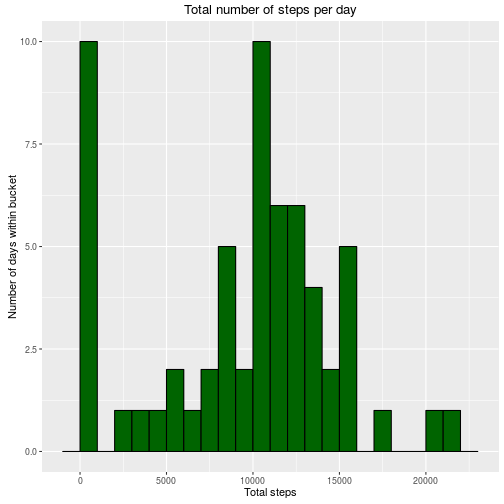
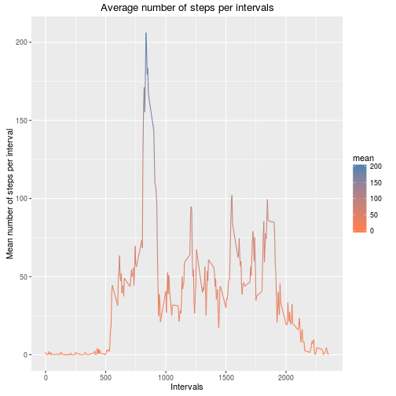
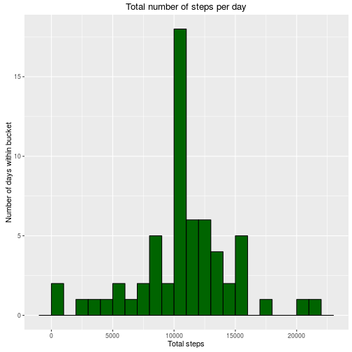
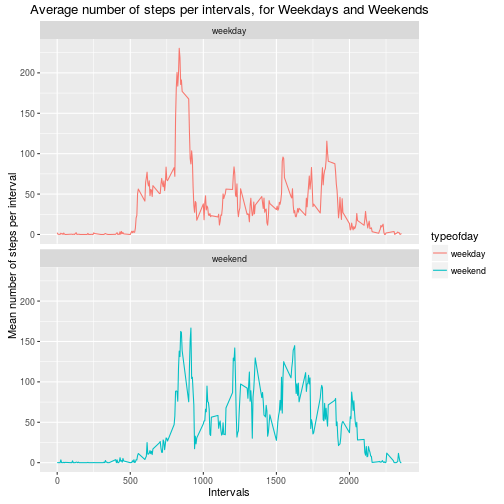

- Author: Antonio Ferraro (anfe67)
- For:    Reproducible Research Jan 2016

## Loading and preprocessing the data

I take the zip file (activity.zip) as provided, unzip it and load into a dataframe. I do not bother downloading it
as it is already provided with the github repository. Then I take a look at the data.


```r
unzip("activity.zip")
activity <- read.csv("activity.csv")

str(activity)
```

```
## 'data.frame':	17568 obs. of  3 variables:
##  $ steps   : int  NA NA NA NA NA NA NA NA NA NA ...
##  $ date    : Factor w/ 61 levels "2012-10-01","2012-10-02",..: 1 1 1 1 1 1 1 1 1 1 ...
##  $ interval: int  0 5 10 15 20 25 30 35 40 45 ...
```

```r
summary(activity)
```

```
##      steps                date          interval     
##  Min.   :  0.00   2012-10-01:  288   Min.   :   0.0  
##  1st Qu.:  0.00   2012-10-02:  288   1st Qu.: 588.8  
##  Median :  0.00   2012-10-03:  288   Median :1177.5  
##  Mean   : 37.38   2012-10-04:  288   Mean   :1177.5  
##  3rd Qu.: 12.00   2012-10-05:  288   3rd Qu.:1766.2  
##  Max.   :806.00   2012-10-06:  288   Max.   :2355.0  
##  NA's   :2304     (Other)   :15840
```

```r
head(activity)
```

```
##   steps       date interval
## 1    NA 2012-10-01        0
## 2    NA 2012-10-01        5
## 3    NA 2012-10-01       10
## 4    NA 2012-10-01       15
## 5    NA 2012-10-01       20
## 6    NA 2012-10-01       25
```

The first thing that I would like to verify here is that the data is consistent and the number of intervals is correct, so my data interpretation is correct. If these are 5 minutes intervals, we are looking at 1 subject, we are looking at 1 device. Then I would expect, assuming that we monitor the subject 24 hours per day, a total of 12 (intervals of 5 minutes in 1 hour) * 24 (hours in a day) = 288 intervals per date. This results from the summary, so the number of observations is OK. I struggled a bit to understand the intervals, until I noticed that they actually encode hour and minute. 2225 means actuall 22:25, so 10:25 Pm. this can be noticed at first by when browsing the values and noticing that after 55 there is 100. Then it becomes clear.    

I transform the dates in something more usable and get the weekdays as well. 
I also compute whether days are weekdays or weekends. Then I look at it again. 


```r
library(lubridate)
activity$date <- as.Date(activity$date)

activity$weekday <- wday(activity$date, label=TRUE, abbr=FALSE)
activity$typeofday <- ifelse((activity$weekday=="Saturday" | activity$weekday=="Sunday"), "weekend", "weekday")

head(activity)
```

```
##   steps       date interval weekday typeofday
## 1    NA 2012-10-01        0  Monday   weekday
## 2    NA 2012-10-01        5  Monday   weekday
## 3    NA 2012-10-01       10  Monday   weekday
## 4    NA 2012-10-01       15  Monday   weekday
## 5    NA 2012-10-01       20  Monday   weekday
## 6    NA 2012-10-01       25  Monday   weekday
```

## What is mean total number of steps taken per day?

The task is twofold: First an istogram of total number of steps taken per day (ignoring NAs): 

```r
# Number of steps taken each day 
totals <- aggregate(activity$steps, by=list(activity$date), FUN=sum, na.rm=TRUE)

# Column names
names(totals) <- c("date", "total")

# Compute the histogram of the total number of steps each day 
library(ggplot2)
ggplot(aes(x = total), data = totals) +
   geom_histogram(binwidth=1000, color = 'black', fill = 'darkgreen') +
   ggtitle("Total number of steps per day") +
   ylab("Number of days within bucket") +
   xlab("Total steps")
```

 


As a second task I compute the mean and median total number of steps per day: 


```r
mean(totals$total)
```

```
## [1] 9354.23
```

```r
median(totals$total)
```

```
## [1] 10395
```

## What is the average daily activity pattern?

Averaging on the five minutes intervals, then plotting. 


```r
intervalaverages <- aggregate(activity$steps, 
                              by=list(activity$interval), 
                              FUN=mean, 
                              na.rm=TRUE)


names(intervalaverages) <- c("interval", "mean")

ggplot(aes(x=interval, y=mean, colour=mean), data=intervalaverages) + 
   geom_line()+ 
   scale_colour_gradient(low="coral", high="steelblue")+
   ggtitle("Average number of steps per intervals") +
   ylab("Mean number of steps per interval") +
   xlab("Intervals")      
```

 

I used the gradient to help me spot the maximum by just looking at the plot. The interval with maximum average number of steps is: 


```r
# We find the position of the maximum mean
wheremax <- which(intervalaverages$mean == max(intervalaverages$mean))

# printing the value of interval at this position and its value...
intervalaverages[wheremax, ]
```

```
##     interval     mean
## 104      835 206.1698
```

```r
# Hey! This guy goes to work late ! :-)
```

## Imputing missing values

Calculating the total number of missing values (rows with NAs): 

```r
sum(is.na(activity$steps))
```

```
## [1] 2304
```

However, this could be seen already when we did the initial summary on the data. 

The strategy for inputing the missing data shall be to give to the intervals the mean of the full cases for same interval, using the already calculated intervalaverages. 

```r
library(dplyr)
```


```r
# If steps is.na then I take the mean of the interval otherwise I take the step as is... 
activityinputed<-activity %>%
      group_by(interval) %>%
      mutate(steps = ifelse (is.na(steps), mean(steps, na.rm=TRUE), steps))


# Number of steps taken each day 
totals <- aggregate(activityinputed$steps, by=list(activityinputed$date), FUN=sum, na.rm=TRUE)

# Column names
names(totals) <- c("date", "total")

# Compute the histogram of the total number of steps each day 
library(ggplot2)
ggplot(aes(x = total), data = totals) +
   geom_histogram(binwidth=1000, color = 'black', fill = 'darkgreen') +
   ggtitle("Total number of steps per day") +
   ylab("Number of days within bucket") +
   xlab("Total steps")
```

 

The histogram now looks rather different, the anomaly on the first bin seems to have disappeared. The mean and median values on the new totals are: 

```r
mean(totals$total)
```

```
## [1] 10766.19
```

```r
median(totals$total)
```

```
## [1] 10766.19
```
Rather strangely they are equal. 


## Are there differences in activity patterns between weekdays and weekends?

The factor typeofday that I have created earlier in the activity and therefore in the activityinputed dataframes responds to the first request. I have already the differentiation between weekdays and weekends. 


```r
intervalaverages <- aggregate(activityinputed$steps, 
                              by=list(activityinputed$interval, activityinputed$typeofday), 
                              FUN=mean, 
                              na.rm=TRUE)


names(intervalaverages) <- c("interval", "typeofday", "mean")

ggplot(aes(x=interval, y=mean, colour=typeofday), data=intervalaverages) + 
   facet_wrap(~typeofday, ncol = 1) +
   geom_line()+ 
   ggtitle("Average number of steps per intervals, for Weekdays and Weekends") +
   ylab("Mean number of steps per interval") +
   xlab("Intervals")      
```

 


From the plot, we can deduce that for the weekends (just my interpretation of the plots): 

1. The person tends to start moving later in the morning (probably sleeps longer)
2. The peak is lower  
3. There are more steps distributed during the day compared to weekdays
4. There is a little bit more activity around 20:00. 


